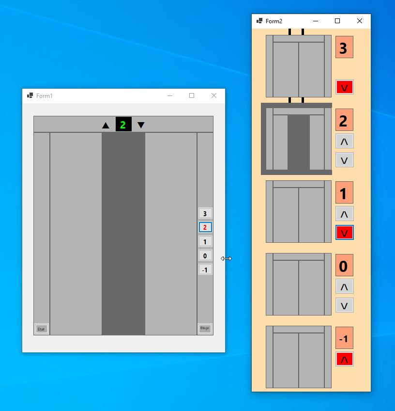
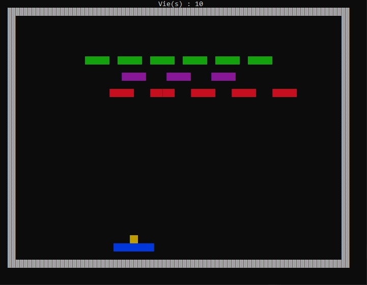
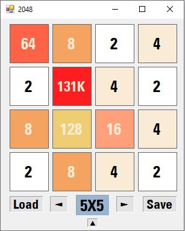
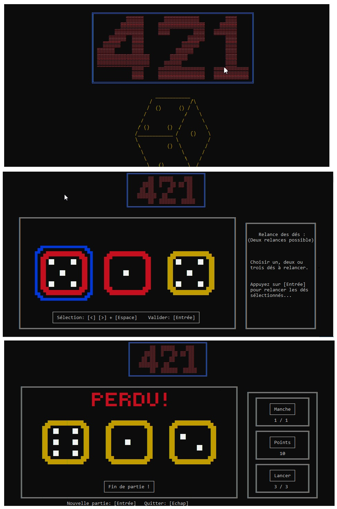
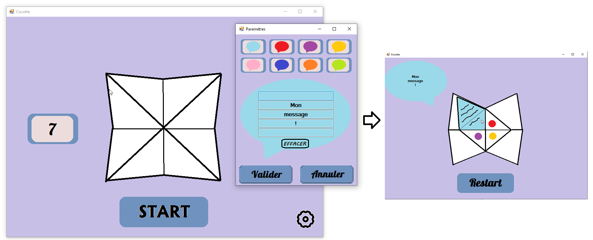
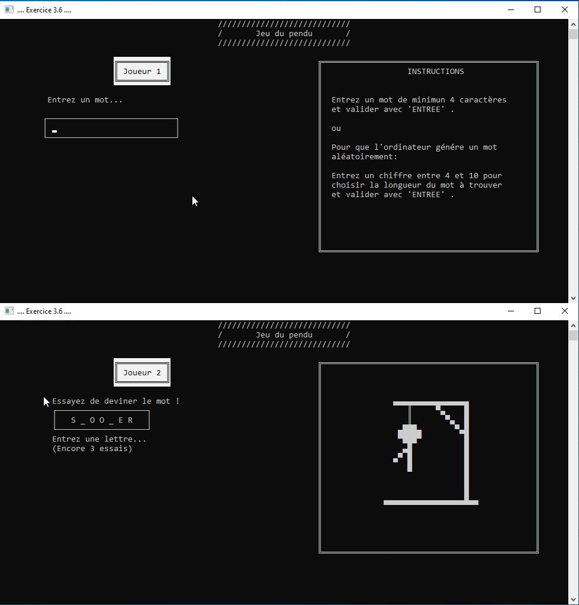

## L'ascenseur [C# (Design pattern State) - WinForms]

## Casse-briques [C# - Console]
(4ème mois de formation)  

## Baker [JavaScript - VueJs]

## 2048 [C# - WinForms]

## 421 [C# - Console]
(3ème mois de formation)  

## Jeu de la cocotte [C# - WinForms]

## Jeu du pendu [C# - Console]
(1er mois de formation)  

